# Jobs Support Services

This directory contains the source code for the jobs support services.

## Overview

The jobs support service allows other services to cooperate in a distributes or background task.
A single job represents an instance of a potentially long-running and complex workflow.
A job contains steps that represent changes in the state of the job, where other subscribed services can react to them.

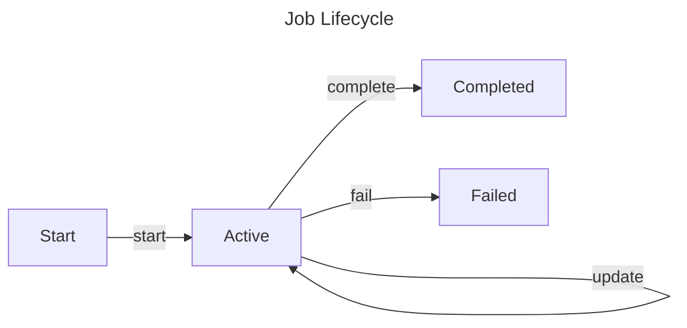

## Glossary

- **Job**: A single instance of a potentially long-running and complex workflow.
- **Step**: A single change in the state of a job.
- **Service**: The service responsible for starting a Job. Allows for filtering process changes from subscribed processes.
- **Entity**: An entity type mot related to the current job. It allows for filtering process changes from subscribed processes.
- **Type**: The type of the job. It allows for filtering process changes from subscribed processes.
- **Input**: Indicates an initial and immutable input for the job.
- **State**: Indicates the current state of the job, containing variables that can be changed during the job's lifetime.
- **ETag**: A unique identifier for the current state of the job. When updating a job, the ETag must be provided to ensure that the job is not updated by another process.

## API Protocols

### Commands

Built-In statuses:

- `started`: The job has been started.
- `completed`: The job has been completed successfully.
- `failed`: The job has failed.
- `canceled`: The job has been canceled.

#### StartJob Command

A job is usually started as a result of a user request, but it can also be started by any system event.

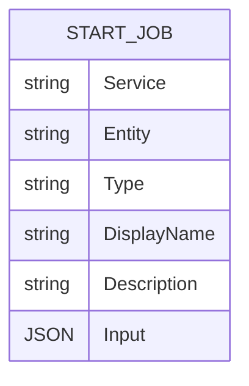

To start a job, all descriptive information must be provided, as well as the initial input and state.

When started, a job jets the default status of `started`. Later commands can change the status and state of the job.

#### UpdateJob Command

A job can be updated by any service that is subscribed to the job. The update command allows to change the state and status of the job.

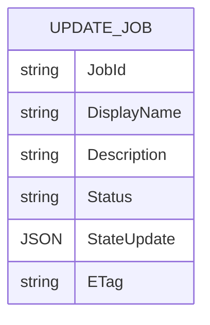

The `ETag` field allows to ensure that the job is not updated by another process. The client services should deploy the consumers in such a way that this is an unlikely scenario.

#### CompleteJob Command

A job can be completed by any service that is subscribed to the job. The complete command allows to change the state and status of the job.

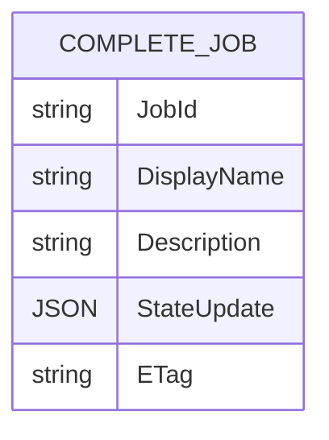

#### FailJob Command

A job can be failed by any service that is subscribed to the job. The fail command allows to change the state and status of the job.

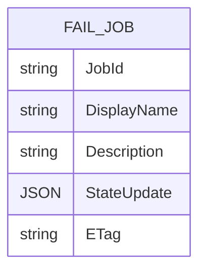

#### CancelJob Command

A job can be canceled by any service that is subscribed to the job, or by user's request.

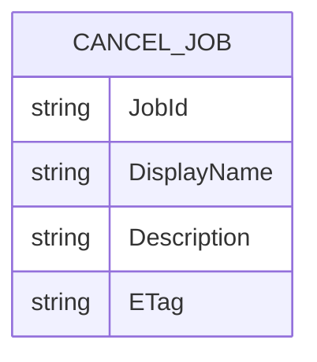

### Integration Events

#### JobStarted Integration Event

This event is published when a job is started.

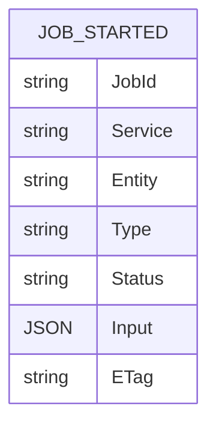

#### JobUpdated Integration Event

This event is published when a job is updated.

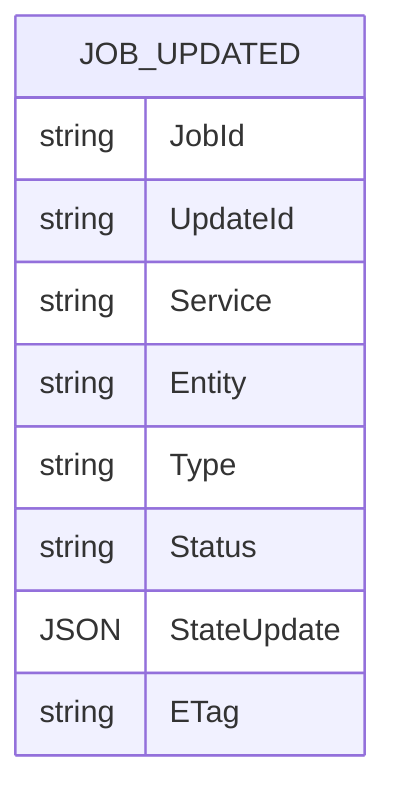

#### JobCompleted Integration Event

This event is published when a job is completed.

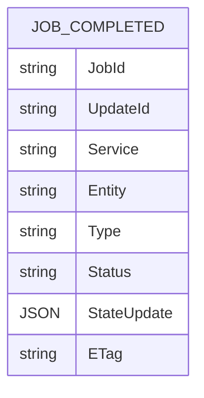

#### JobFailed Integration Event

This event is published when a job is failed.

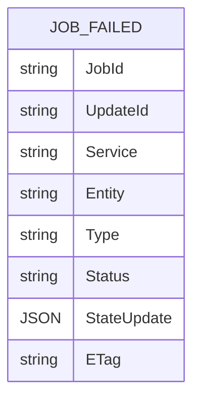

#### JobCanceled Integration Event

This event is published when a job is canceled.

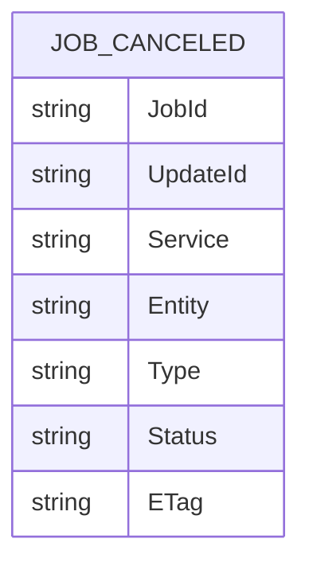

### DataTypes

#### Job Entity

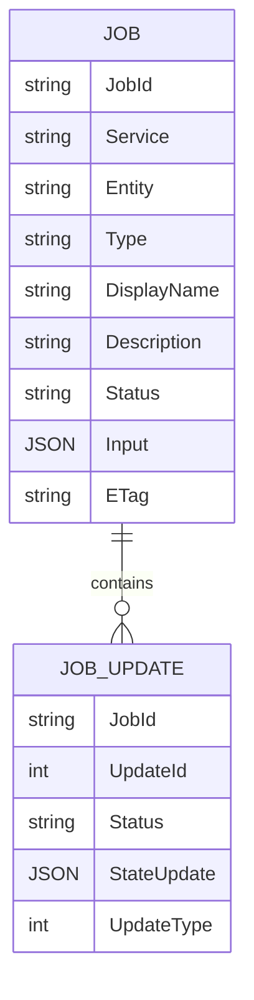

Where `UpdateType` is an enum with the following values:

- `0`: `Updated`
- `1`: `Completed`
- `2`: `Failed`
- `3`: `Canceled`

### Queries

#### GetJobById Query

This query allows to retrieve a job by its ID.

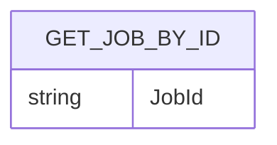

The result of the query is a [`Job` entity](#job-entity).
